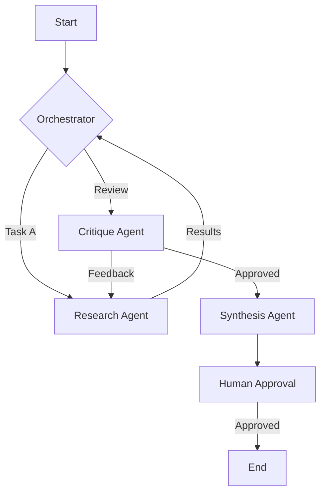

# Aether-Agent-Orchestrator 🌌

A production-grade, multi-agent orchestration framework designed for complex, non-linear enterprise workflows. Unlike traditional linear chains, Aether uses a graph-based state machine to manage agent interactions, enabling autonomous reasoning and robust error recovery.

## 🚀 Key Features

- **Graph-Based Orchestration**: Define complex workflows as directed graphs where agents are nodes and transitions are based on reasoning outputs.
- **Stateful Persistence**: Built-in state management allows long-running tasks to be paused, resumed, or audited at any point.
- **Agentic Observability**: Integrated tracing for agent "thoughts," tool calls, and transitions using OpenTelemetry standards.
- **Human-in-the-Loop (HITL)**: First-class support for manual approval gates in sensitive workflows.
- **Plug-and-Play Tools**: Easily register custom tools (APIs, databases, scripts) that agents can autonomously invoke.

## 🛠️ Architecture

Aether separates **Reasoning** from **Action**. The Orchestrator manages the global state and decides which Agent to invoke next based on the workflow graph.



## 📦 Installation

```bash
pip install -r requirements.txt
```

## 🚦 Quick Start

```python
from aether import Orchestrator, Agent, State

# Define your agents
researcher = Agent(name="Researcher", role="Gathers data from web sources")
writer = Agent(name="Writer", role="Synthesizes data into a report")

# Initialize orchestrator
orchestrator = Orchestrator(agents=[researcher, writer])

# Run a workflow
final_state = orchestrator.run("Generate a market analysis for generative AI in 2024.")
print(final_state.output)
```

## 📜 License
MIT
